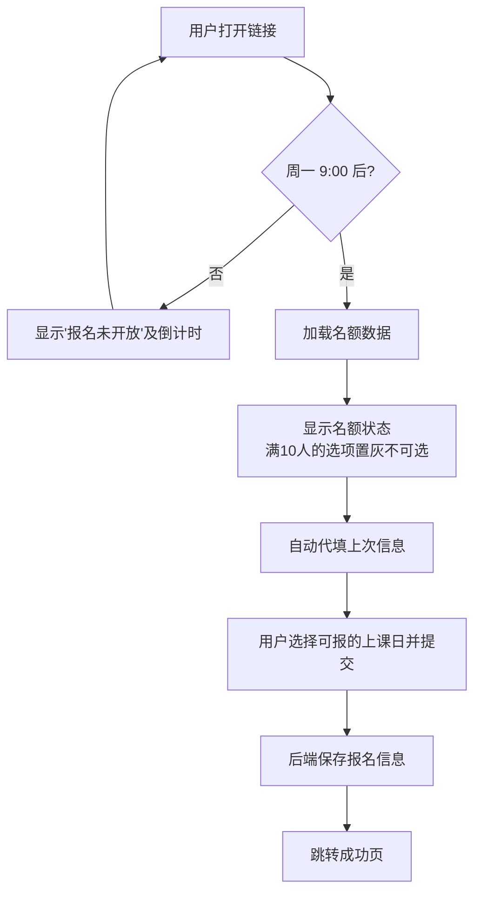

## 1. 产品概述

一个通过手机微信即可访问的网球课报名工具，每周一上午9:00自动开放当周报名，提供姓名、手机号、上课日（周二/周三）三个字段的报名表单，每个上课日限额10人。管理员可导出报名列表用于课程安排。

- 解决网球课程报名信息收集、名额管控、防止超额、数据归档的问题
- 面向网球学员（报名端）和课程管理员（管理端）

## 2. 核心功能

### 2.1 用户角色
| 角色 | 使用方式 | 核心权限 |
|------|----------|----------|
| 报名学员 | 微信直接打开链接 | 填写报名信息、查看名额余量 |
| 管理员 | 访问管理页面 | 查看所有报名记录、导出CSV报名列表 |

### 2.2 功能模块
1. **报名页**：名额展示（页面加载即显示）、表单填写、提交报名
2. **报名成功页**：显示报名成功信息和注意事项
3. **管理后台**：查看所有报名记录，支持导出CSV

### 2.3 页面详情
| 页面名称 | 模块名称 | 功能描述 |
|----------|----------|----------|
| 报名页 | 名额展示 | 页面加载即显示周二/周三当前已报名人数（X/10），满10人时置灰禁用 |
| 报名页 | 报名表单 | 姓名（必填）、手机号（必填）、上课日选择（周二/周三，满10人置灰不可选） |
| 报名页 | 自动代填 | 读取上次填写记录（浏览器本地存储），自动填充3个字段 |
| 报名页 | 开放控制 | 每周一9:00开放报名，非开放时间显示倒计时/提示 |
| 报名成功页 | 结果展示 | 显示报名成功信息、已选上课日、注意事项 |
| 管理后台 | 报名列表 | 按周筛选显示所有报名记录，每个记录包含姓名、手机号、上课日、报名时间 |
| 管理后台 | 数据导出 | 一键导出CSV格式报名列表 |

## 3. 核心流程

```
报名流程：
用户打开链接
    ↓
周一 9:00 前 → 显示"报名未开放"提示（含距离开放倒计时）
    ↓
周一 9:00 后 → 进入报名页，加载实时名额数据
    ↓
页面显示：周二 (X/10) | 周三 (Y/10)
满10人的选项显示"已满"并置灰不可选
    ↓
自动填入上次填写的信息（姓名、手机号、上次选择的日期）
    ↓
用户修改/确认信息 → 选择可报的上课日 → 点击提交
    ↓
后端保存报名信息 → 跳转成功页
```



## 4. 用户界面设计

### 4.1 设计风格
- **主色调**：活力网球绿 (#2D8A4E) + 白色背景
- **辅色调**：暖橙色 (#F5A623) 用于满额标记
- **字体**：系统默认字体（微信内置浏览器兼容）
- **按钮样式**：圆角大按钮，绿色填充，触感友好
- **布局风格**：卡片式垂直布局，移动端全屏适配
- **整体调性**：简洁、清爽、运动感、信息清晰

### 4.2 页面设计概览
| 页面名称 | 模块名称 | UI元素 |
|----------|----------|--------|
| 报名页 | 名额展示 | 两个信息卡片（周二/周三），显示"已报名 X/10 人"，满额时卡片置灰+"已满"标签 |
| 报名页 | 报名表单 | 输入框（姓名、手机号）、选项按钮组（上课日，满额项置灰禁用）、提交按钮 |
| 报名页 | 未开放状态 | 半透明遮罩+提示文案"报名将在周一 9:00 开放" |
| 报名成功页 | 结果展示 | 绿色勾选图标、成功文案、报名详情摘要 |
| 管理后台 | 数据管理 | 表格展示报名记录，按周筛选，导出按钮 |

### 4.3 响应式
- **移动端优先**：全量适配手机微信内置浏览器
- 所有元素最大宽度 480px，居中显示
- 触摸友好的按钮和输入区域（最小 44px 触摸区域）
- 禁止页面缩放（viewport 禁止缩放）
- 微信内置浏览器兼容性优化