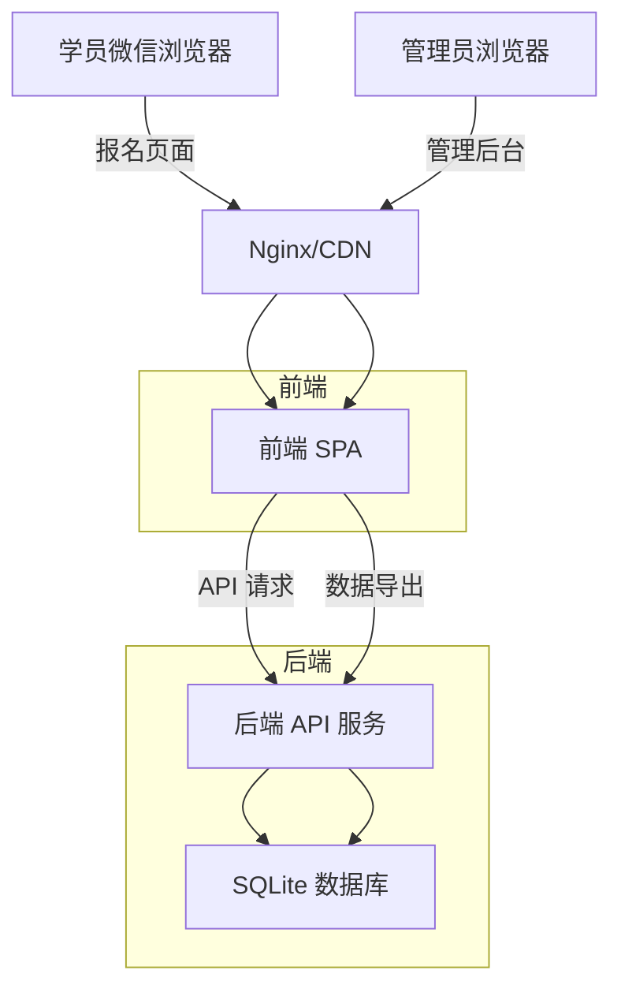
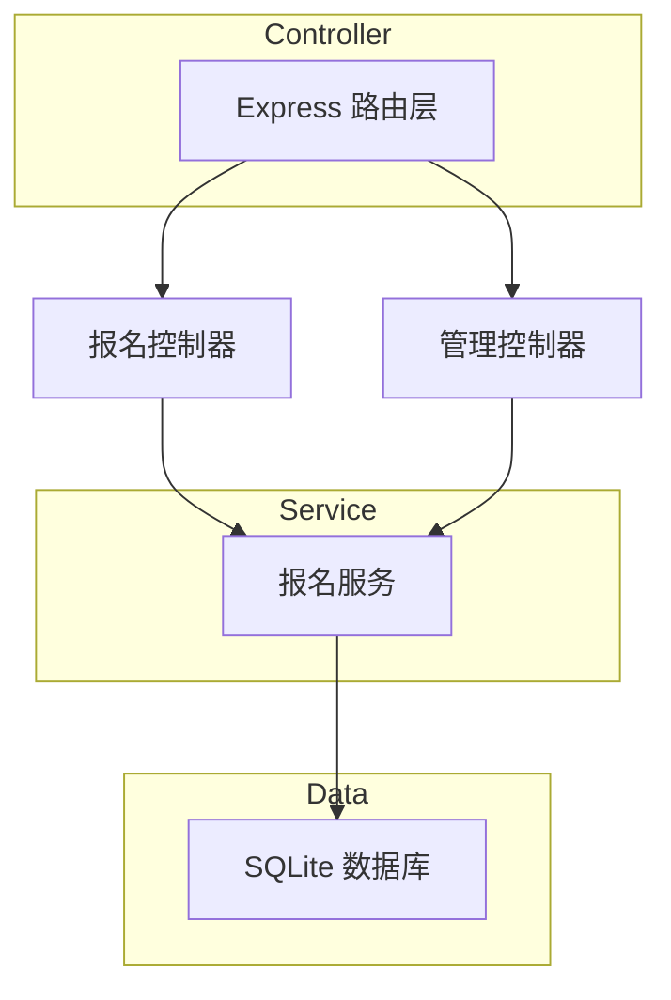
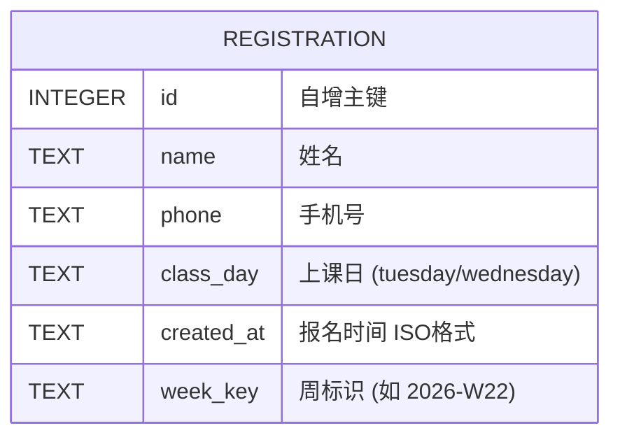

## 1. 架构设计

采用前后端分离架构，前端提供报名页面和管理后台，后端提供数据存储和API服务。



## 2. 技术选型

| 层次 | 选型 | 理由 |
|------|------|------|
| **前端** | Vue 3 + Vite | 轻量响应式，适合表单交互，构建产物小 |
| **后端** | Node.js + Express | 轻量级HTTP服务器，部署简单 |
| **数据库** | SQLite (better-sqlite3) | 零配置，文件型数据库，无需独立数据库服务 |
| **部署** | 单机部署 | 前后端可部署在同一台服务器或同一平台 |

## 3. 路由定义

### 前端路由
| 路由 | 用途 |
|------|------|
| `/` | 报名页（主页面） |
| `/success` | 报名成功页 |
| `/admin` | 管理后台（查看/导出报名列表） |

### 后端 API
| 方法 | 路由 | 用途 |
|------|------|------|
| GET | `/api/status` | 获取当前周二/周三的名额状态 |
| POST | `/api/register` | 提交报名 |
| GET | `/api/registrations` | 获取报名列表（支持周筛选） |
| GET | `/api/export` | 导出CSV报名列表 |

## 4. API 定义

### GET /api/status
返回当前周周二和周三的报名人数
```typescript
interface StatusResponse {
  tuesday: number;  // 0-10
  wednesday: number; // 0-10
  isOpen: boolean;   // 是否在开放时间
  nextOpenTime?: string; // 下次开放时间
}
```

### POST /api/register
```typescript
interface RegisterRequest {
  name: string;
  phone: string;
  classDay: 'tuesday' | 'wednesday';
}

interface RegisterResponse {
  success: boolean;
  message: string;
  registration?: {
    id: string;
    name: string;
    phone: string;
    classDay: string;
    createdAt: string;
  };
}
```

### GET /api/registrations?week=2026-W22
```typescript
interface RegistrationsResponse {
  registrations: Array<{
    id: string;
    name: string;
    phone: string;
    classDay: string;
    createdAt: string;
    weekKey: string;
  }>;
}
```

### GET /api/export?week=2026-W22
返回 CSV 文件下载

## 5. 服务器架构



## 6. 数据模型

### 6.1 ER 图



### 6.2 建表语句

```sql
CREATE TABLE IF NOT EXISTS registrations (
    id INTEGER PRIMARY KEY AUTOINCREMENT,
    name TEXT NOT NULL,
    phone TEXT NOT NULL,
    class_day TEXT NOT NULL CHECK(class_day IN ('tuesday', 'wednesday')),
    created_at TEXT NOT NULL DEFAULT (datetime('now')),
    week_key TEXT NOT NULL
);

CREATE INDEX idx_registrations_week ON registrations(week_key);
CREATE INDEX idx_registrations_week_day ON registrations(week_key, class_day);
```

## 7. 前端组件结构

```
App.vue
├── RegistrationPage.vue      # 报名主页面
│   ├── SlotStatusCard.vue     # 名额展示卡片（周二/周三各一个）
│   ├── RegistrationForm.vue   # 报名表单
│   └── ClosedOverlay.vue      # 报名未开放时的遮罩
├── SuccessPage.vue            # 报名成功页
└── AdminPage.vue              # 管理后台
    └── RegistrationTable.vue   # 报名记录表格
```

## 8. 部署方案

- 前端构建后由后端 Express 静态托管
- 单进程部署，SQLite 文件存储
- 可部署到任何支持 Node.js 的平台（VPS、Railway、Render等）
- 生成固定链接（如 `https://tennis-register.example.com`）